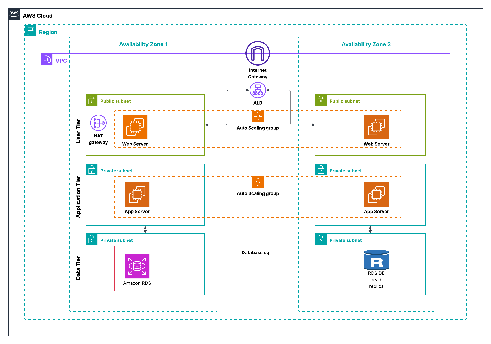

# Highly Available 3-Tier Architecture on AWS

This repository documents a hands-on guide for building a highly available 3-tier architecture on AWS. 

## Architecture Overview

The solution includes the following components:

- Web Tier (Apache)
- Application Tier (App server)
- Database Tier (Amazon RDS MariaDB)
- Security and networking (VPC, subnets, route tables, security groups)
- Auto Scaling Groups and Launch Templates
